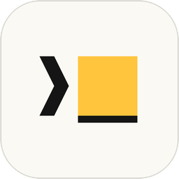
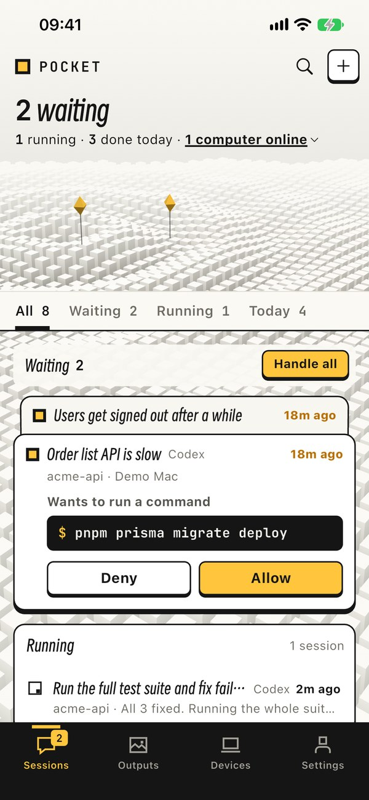
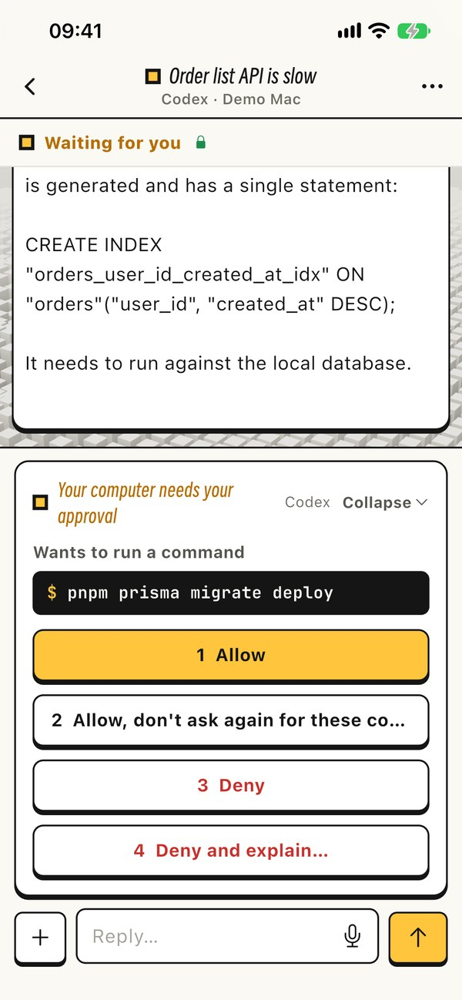
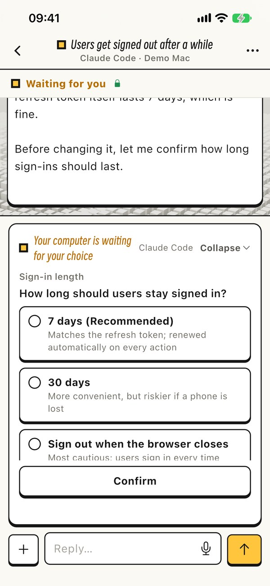
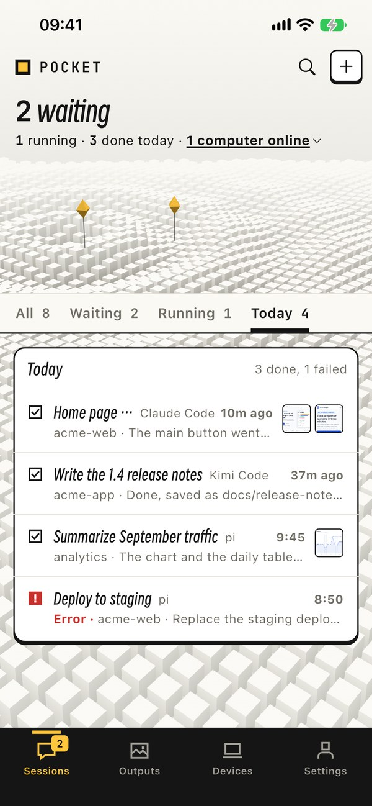
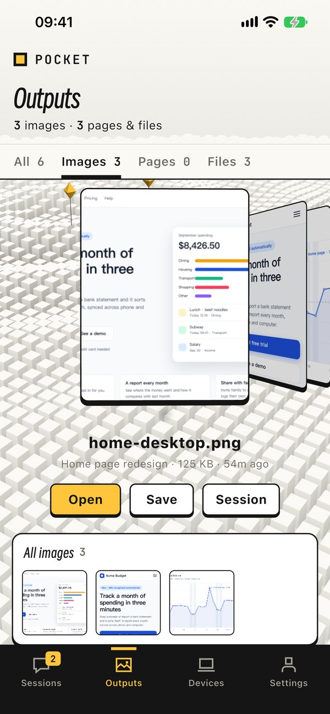
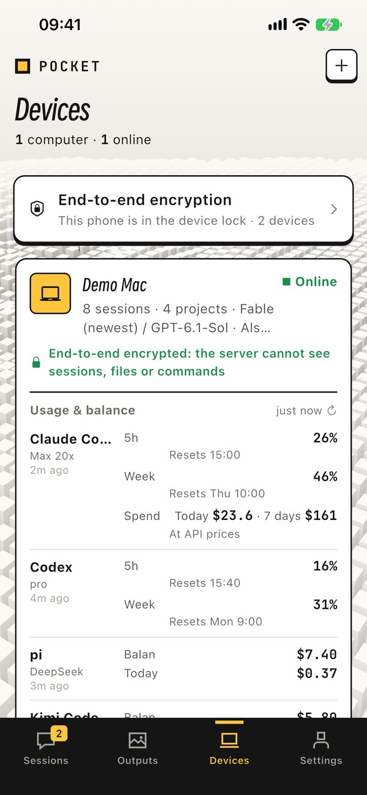

English | [简体中文](README.zh-CN.md)

<p align="center"></p>

<h1 align="center">Pocket</h1>

<p align="center"><b>Your AI coding agents, in your pocket.</b><br>
Claude Code, Codex, pi, Kimi Code and DeepSeek Harness keep working on your computer.<br>
From your phone, follow their progress, approve what they ask and see what they make.</p>

<p align="center">
  <a href="#download">Download</a> ·
  <a href="https://pocket.pocketcli.net/en">Website</a> ·
  <a href="https://pocket.pocketcli.net/en/privacy">Privacy</a> ·
  <a href="https://pocket.pocketcli.net/en/support">Support</a>
</p>

| Sessions and what's waiting | Approve a command | Answer a question |
|:---:|:---:|:---:|
|  |  |  |
| **Every AI in one list** | **What the AI made** | **Limits and balances** |
|  |  |  |

<sub>Real screenshots of the iPhone app (version 0.1.20) signed in to the demo account. The projects and numbers (Acme) are made up.</sub>

## What you can do

- **See every session.** Running, waiting for you, done or failed, on all your computers.
- **Approve and answer from your phone.** Allow or deny a command, pick an answer when the AI asks a question, approve a plan, or tell it what to change.
- **Send the next task.** Type, or hold to talk. Start a new session and pick the AI, the model and the reasoning effort. Attach files and photos from your phone.
- **See what it made.** Screenshots, web pages and documents the AI creates arrive on your phone.
- **Five AIs.** Claude Code, Codex, pi, Kimi Code and DeepSeek Harness.
- **Search.** Session titles and everything that was said; tap a match to jump to that message.
- **Hand off to another AI.** Pocket stops the current AI, writes handoff notes (the task, the recent conversation, the files it changed) and starts the next AI in the same project with your instructions and the model you pick.
- **Multi-agent teams.** A lead AI can hand parts of the work to helper AIs working in the same project.
- **Limits and balances.** Claude Code and Codex usage limits with their reset times; pi and Kimi Code balances.
- **Dark mode** that follows your phone.

## Download

| Platform | File | Notes |
|---|---|---|
| Android | [Pocket.apk](https://github.com/ltsqyg-lab/pocket-releases/releases/latest/download/Pocket.apk) | Phone app. Allow installing apps from unknown sources when asked. |
| iPhone | [Pocket-unsigned.ipa](https://github.com/ltsqyg-lab/pocket-releases/releases/latest/download/Pocket-unsigned.ipa) | Phone app, unsigned. Sideload it with AltStore or Sideloadly, or install it on your own device with Xcode. |
| Mac | [Pocket-Mac.pkg](https://github.com/ltsqyg-lab/pocket-releases/releases/latest/download/Pocket-Mac.pkg) | Desktop app. Apple silicon (M1 or later), macOS 13 or later. |
| Windows | [Pocket-Windows-Setup.exe](https://github.com/ltsqyg-lab/pocket-releases/releases/latest/download/Pocket-Windows-Setup.exe) | Desktop app. 64-bit Windows 10 or 11. |

These links always point to the latest release. Version numbers, sizes, checksums and older versions are on the [Releases](https://github.com/ltsqyg-lab/pocket-releases/releases) page.

If GitHub is slow or unreachable where you are (for example in mainland China), use the [download section of the website](https://pocket.pocketcli.net/en#download): same files, served by Pocket instead of GitHub.

## Getting started

1. **Install the desktop app on the computer that runs your AI coding tools.**
   - **Mac:** open `Pocket-Mac.pkg` and follow the installer. If macOS refuses to open it, go to System Settings → Privacy & Security and click **Open Anyway**. Allow the Accessibility and Automation permissions it asks for: Pocket needs them to pass what you do on your phone (messages, approvals, answers) to the AI tools in your terminal windows. Pocket then lives in the menu bar.
   - **Windows:** run `Pocket-Windows-Setup.exe`. If SmartScreen stops it, click **More info → Run anyway**. Pocket then lives in the system tray; the tray icon is also its on/off switch.
   - Sign in from the Pocket icon. It opens a page in your browser where you can sign in or create an account.
   - The desktop app is only available in Chinese for now.
2. **Install the phone app and sign in with the same account.**
   - **Android:** install `Pocket.apk`.
   - **iPhone:** Pocket is not on the App Store yet, and TestFlight testing is by invitation only. Until then, sideload `Pocket-unsigned.ipa`.
   - Accounts are created with an email address, in the app or on the sign-in page. Sign-ups are limited for now.
3. **Approve your devices.** The first phone you sign in on turns on end-to-end encryption for your account. Every computer or phone you add after that has to be approved on a device you already use: both screens show the same six words; if they match, approve it on one and confirm on the other.

Your sessions then show up on your phone.

## End-to-end encryption

Since desktop app 0.1.38 and phone app 0.1.20, sessions, files, commands, and the messages and answers you send are end-to-end encrypted. The keys exist only on your phones and computers. Pocket's servers and the relay only pass on, and briefly store, encrypted data they cannot read. What the servers can still see: your account email, which devices you have (name, type, public key), when they are online, how much data they exchange, and IP addresses.

A new device can only read your content after you approve it on a device you already use, so whoever runs the server cannot quietly add one.

The parts that handle your data in transit are open source (AGPL-3.0):

- [pocket-relay](https://github.com/ltsqyg-lab/pocket-relay) — stores and forwards the encrypted data between your devices. You can run your own relay and switch to it in the app.
- [pocket-asr](https://github.com/ltsqyg-lab/pocket-asr) — the speech-to-text gateway behind voice input. In the app you choose where speech is turned into text: Pocket's cloud, your own computer, your phone, or a gateway you run yourself.

Apps and desktop apps that have not been updated keep working the old way (the servers can see their content) until November 6, 2026. After that, the old plaintext records are deleted from the servers. Details are in the [privacy policy](https://pocket.pocketcli.net/en/privacy).

## Verify a download

Every release includes `manifest.json` with the SHA-256 checksum of each file. The same checksums are in the release notes.

```sh
shasum -a 256 Pocket-Mac.pkg                        # macOS
sha256sum Pocket.apk                                # Linux
certutil -hashfile Pocket-Windows-Setup.exe SHA256  # Windows
```

`manifest.json` also carries an Ed25519 signature for each file over the text `pocket-update/1\n<file>\n<version>\n<sha256>`. The Mac app's built-in updater refuses any package whose signature does not verify. To check the signatures yourself with Node.js, run this next to `manifest.json`:

```sh
node -e '
const c = require("crypto"), m = require("./manifest.json")
const key = c.createPublicKey({ key: { kty: "OKP", crv: "Ed25519", x: "YT0DFmHTooXbK16fan5oiLD9WEq90_6cSEDOUigWlg4" }, format: "jwk" })
for (const p of m.packages)
  console.log(p.file, p.ver, c.verify(null, Buffer.from(`pocket-update/1\n${p.file}\n${p.ver}\n${p.sha256}`), key, Buffer.from(p.sig, "base64")) ? "signature OK" : "BAD SIGNATURE")
'
```

## Privacy and support

- [Privacy policy](https://pocket.pocketcli.net/en/privacy) · [Terms of service](https://pocket.pocketcli.net/en/terms) · [Support](https://pocket.pocketcli.net/en/support)
- Email: [service@pocketcli.net](mailto:service@pocketcli.net)

## About this repository

This repository only hosts the compiled installers; it contains no source code. The installers are attached to each [release](https://github.com/ltsqyg-lab/pocket-releases/releases).
