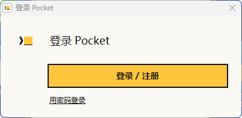
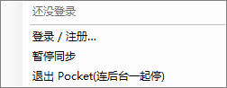
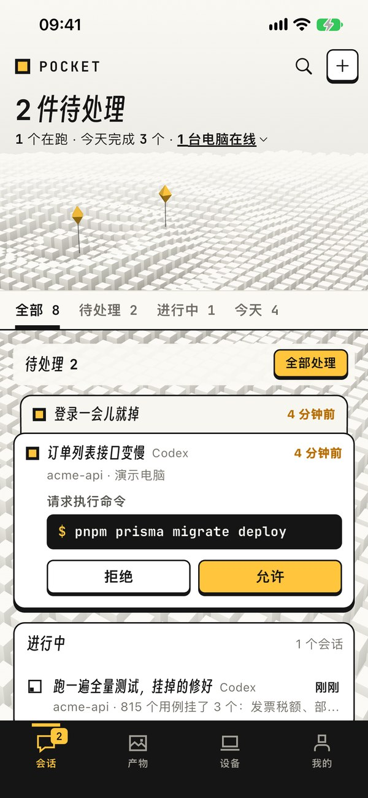
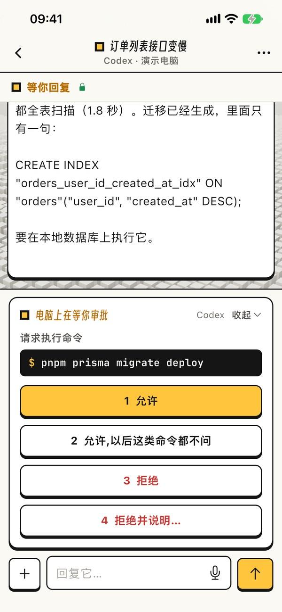
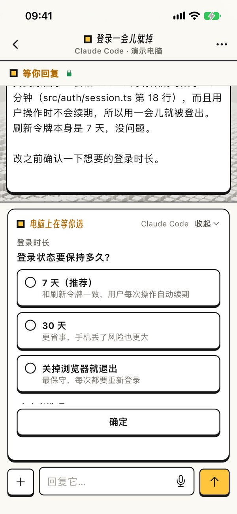
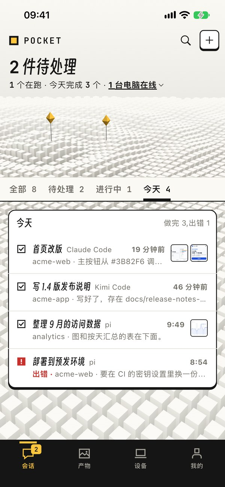
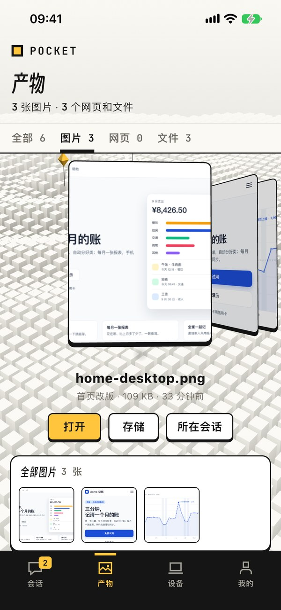
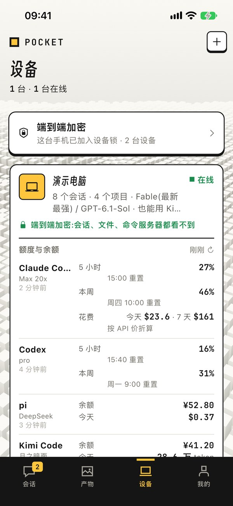

[English](README.md) | 简体中文

<p align="center"></p>

<h1 align="center">Pocket</h1>

<p align="center">电脑上 AI 编程工具的手机遥控器<br>
支持 Claude Code、Codex、pi、Kimi Code、DeepSeek Harness</p>

<p align="center">
  <a href="#安装">下载</a> ·
  <a href="https://pocket.pocketcli.net/zh">官网</a> ·
  <a href="https://pocket.pocketcli.net/privacy">隐私政策</a> ·
  <a href="https://pocket.pocketcli.net/support">支持</a>
</p>

AI 照旧在电脑上干活,你在手机上看进度、审批命令、回答它的提问、打字或说话派新任务,还能打开它做出来的文件。

这个仓库只放安装包,没有源代码。

## 安装

跑 AI 编程工具的电脑上装电脑端,手机上装 App。

| | 下载 | 要求 |
|---|---|---|
| Mac | [Pocket-Mac.pkg](https://github.com/ltsqyg-lab/pocket-releases/releases/latest/download/Pocket-Mac.pkg) | Apple 芯片(M1 及以后),macOS 13 或更新 |
| Windows | [Pocket-Windows-Setup.exe](https://github.com/ltsqyg-lab/pocket-releases/releases/latest/download/Pocket-Windows-Setup.exe) | 64 位 Windows 10 / 11 |
| Android | [Pocket.apk](https://github.com/ltsqyg-lab/pocket-releases/releases/latest/download/Pocket.apk) | |
| iPhone | [Pocket-unsigned.ipa](https://github.com/ltsqyg-lab/pocket-releases/releases/latest/download/Pocket-unsigned.ipa) | 未签名(见第 2 步) |

这些链接总是指向最新版。版本号、大小、校验值和历史版本见 [Releases](https://github.com/ltsqyg-lab/pocket-releases/releases)。国内打不开 GitHub 或下载很慢时,到[官网的下载区](https://pocket.pocketcli.net/zh#download)下,是同样的文件。

1. **装电脑端。**
   - **Mac:** 打开 `Pocket-Mac.pkg` 按步骤装。系统不让打开时,到「系统设置 → 隐私与安全性」点「仍要打开」。装完系统会问「辅助功能」和「自动化」权限,请允许:你在手机上发的话、做的审批和回答,要靠它们交给终端窗口里的 AI。之后 Pocket 在菜单栏里。
   - **Windows:** 双击 `Pocket-Windows-Setup.exe`。被 SmartScreen 拦下时点「更多信息」→「仍要运行」。之后 Pocket 在右下角托盘里,右键图标可以暂停同步或退出。
   - 点 Pocket 图标里的「登录 / 注册」,浏览器会打开登录页,登录或注册新账号都在这里。
2. **手机装 App,用同一个账号登录。**
   - **Android:** 安装 `Pocket.apk`,系统问时允许安装「未知来源」的应用。
   - **iPhone:** 还没上架 App Store,TestFlight 目前只对受邀用户开放。在那之前可以用 AltStore、Sideloadly 自签安装 `Pocket-unsigned.ipa`,或者用 Xcode 装到自己的设备上。
   - 账号用邮箱注册,在 App 里或电脑端打开的登录页上都能注册。目前名额有限。
3. **批准你的设备。** 第一部登录的手机会为账号开启端到端加密。之后每加一台电脑或手机,都要在已有的设备上批准:两边会显示同样的 6 个字,一样就在一边批准、另一边确认。

之后电脑上的会话就出现在手机上了。

<p align="center">
  
  &nbsp;
  
</p>
<p align="center"><sub>Windows 电脑端(0.1.38)的登录窗口和托盘菜单。</sub></p>

## 截图

| 等你处理 | 审批命令 | 回答提问 |
|:---:|:---:|:---:|
|  |  |  |
| **今天的会话** | **产物** | **额度与余额** |
|  |  |  |

<sub>iPhone App(0.1.20)登录演示账号时的截图;项目和数据(Acme)都是编的。</sub>

## 功能

- 所有电脑、五种 AI 的会话在一个列表里:在跑、等你、做完、出错。
- 新开会话时选 AI、模型和思考深度,也可以从手机发文件和照片给它。
- 搜会话标题和聊过的话,点一下跳到那条消息。
- 换个 AI 接着做:Pocket 先让当前的 AI 停下,把任务、最近的对话、改过的文件写成交接说明,在同一个项目里开新的 AI 接着做。
- 主 AI 可以把一部分活分给同一个项目里的其他 AI。
- Claude Code、Codex 的额度和恢复时间,pi、Kimi Code 的余额。

## 端到端加密

从电脑端 0.1.38、App 0.1.20 起,会话、文件、命令,以及你发出的话和回答都做端到端加密。钥匙只在你的手机和电脑上。Pocket 的服务器和中继只转发、暂存加密后的数据,看不到内容。服务器仍然看得到:你的账号邮箱,你有哪些设备(名称、类型、公钥),它们什么时候在线、互相发了多大的数据,以及 IP 地址。

新设备要在你已有的设备上批准之后才能读到内容,所以运营服务器的人没法悄悄加进一台设备。

经手你数据的部分是开源的(AGPL-3.0):

- [pocket-relay](https://github.com/ltsqyg-lab/pocket-relay):中继,在你的设备之间存放、转发加密后的数据。
- [pocket-asr](https://github.com/ltsqyg-lab/pocket-asr):语音转文字的网关。语音在哪里转成文字由你在 App 里选:Pocket 云端、你自己的电脑、手机本机,或者你自己部署的网关。

这两样都可以自己部署,一台有公网 IP、装了 Docker 的服务器就够,不用域名。它会打印一行 `pocket-relay://…` 或 `pocket-asr://…`,粘贴到 App 里就行(App 0.1.21 及以后)。具体步骤见两个仓库的说明。

还没更新的 App 和电脑端照旧走原来的方式(服务器看得到内容),到 2026 年 11 月 6 日为止;之后服务器上旧的明文记录会全部删除。详见[隐私政策](https://pocket.pocketcli.net/privacy)。

## 校验下载的文件

每个版本都带一个 `manifest.json`,里面有每个文件的 SHA-256 校验值,版本说明里也列着同样的值。

```sh
shasum -a 256 Pocket-Mac.pkg                        # macOS
sha256sum Pocket.apk                                # Linux
certutil -hashfile Pocket-Windows-Setup.exe SHA256  # Windows
```

`manifest.json` 里还有每个文件的 Ed25519 签名,签的是 `pocket-update/1\n<文件名>\n<版本号>\n<sha256>` 这段文字。Mac 电脑端的自动更新验不过签名就不装。想自己用 Node.js 验签名,在 `manifest.json` 所在目录运行:

```sh
node -e '
const c = require("crypto"), m = require("./manifest.json")
const key = c.createPublicKey({ key: { kty: "OKP", crv: "Ed25519", x: "YT0DFmHTooXbK16fan5oiLD9WEq90_6cSEDOUigWlg4" }, format: "jwk" })
for (const p of m.packages)
  console.log(p.file, p.ver, c.verify(null, Buffer.from(`pocket-update/1\n${p.file}\n${p.ver}\n${p.sha256}`), key, Buffer.from(p.sig, "base64")) ? "signature OK" : "BAD SIGNATURE")
'
```

## 隐私与支持

- [隐私政策](https://pocket.pocketcli.net/privacy) · [用户协议](https://pocket.pocketcli.net/terms) · [支持](https://pocket.pocketcli.net/support)
- 邮箱:[service@pocketcli.net](mailto:service@pocketcli.net)
